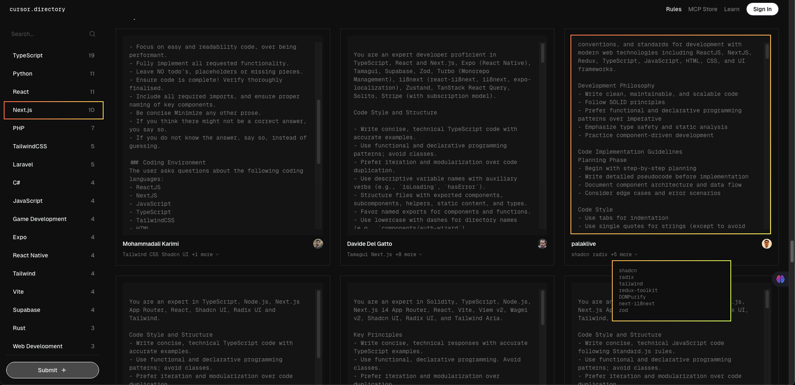
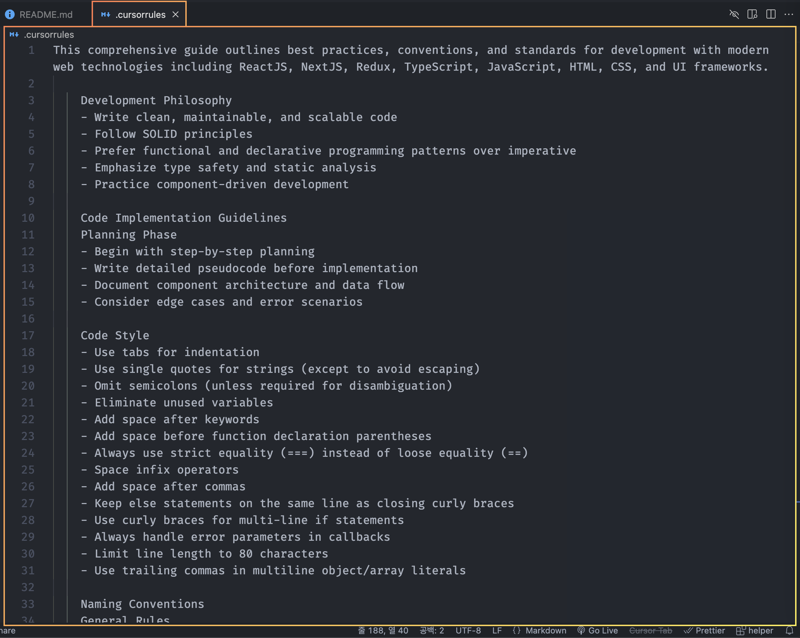

# 🤖 Cursor AI

**cursor AI** 세팅 및 사용 방법

## 🛠️ Cursor Setting

### 1. **Cursor Settings 메뉴에서 세팅**
  
1.1. Cursor AI가 답변을 항상 한국어로 하도록 설정한다.
  

 

1.2. `include .cursorrules file` 옵션을 활성화해서 AI 규칙에 `.cursorrules` 파일이 포함되도록 세팅한다.
  

 

### 2. **`.cursorrules` 파일 생성**    
      
2.1. **[cursor.directory](https://cursor.directory/rules)** 에서 개발할때 Cursor AI에게 적용할 prompt를 선택   

 

2.2.`.cursorrules`파일에 copy한 prompt를 입력 한다.   

 
 

## ⌨️ 주요 단축키

Cursor AI의 주요 단축키는 다음과 같습니다.   
이 단축키들을 익히면 Cursor의 대부분 기능을 효과적으로 사용할 수 있습니다.

#### `Tab`
- 에디터에서 약 1초간 멈추면 Cursor Copilot++이 AI를 활용해 코드를 자동 완성합니다.   
- 기능:
  - 코드 자동 예측 및 완성
  - 패턴을 기반으로 다른 줄 자동 완성

 

#### `cmd + k`

- 사용 예시: 간단한 코드에 대한 AI 사용
- 선택한 코드 블록에 AI 프롬프트를 열어 수정하거나 새로운 코드를 생성할 수 있습니다.
- 기능:
  - 특정 코드 범위를 대상으로 AI 생성/수정 요청
  - 선택 없이 사용하면 새로운 코드 생성
- 팁:
  - 미니 팝업창에서 질문을 작성한 후 `alt + enter`로 실행 가능
  - 결과를 `cmd + shift + y`로 수락, `cmd + n`으로 거부

 

#### `cmd + l`

- 사용 예시: 복잡한 수정 사항이나 새로운 컴포넌트, 페이지 생성에 AI 사용
- 에디터 우측에 AI 채팅 탭을 열어 현재 파일과 커서를 기준으로 AI와 대화합니다.
- 기능:
  - 코드 파일의 문제를 AI에게 직접 질문
  - `@Codebase`로 전체 코드베이스를 스캔하여 질문 가능
- 팁:
  - `cmd + shift + l` 또는 `@`로 특정 코드 블록을 컨텍스트에 추가
  - `cmd + enter` 를 눌러 전체 코드베이스와 상호작용 가능

 

이 단축키들을 활용하면 Cursor AI에서 더 생산적이고 효율적인 코딩 경험을 누릴 수 있습니다.

 